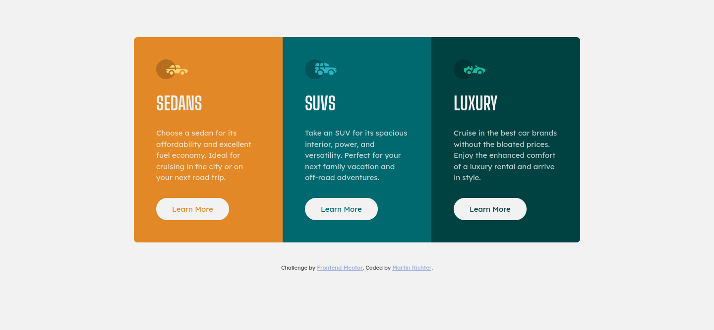
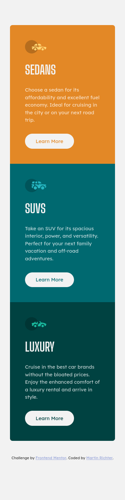

# Frontend Mentor - 3-column preview card component solution

This is a solution to the [3-column preview card component challenge on Frontend Mentor](https://www.frontendmentor.io/challenges/3column-preview-card-component-pH92eAR2-). Frontend Mentor challenges help you improve your coding skills by building realistic projects.

## Table of contents

-   [Overview](#overview)
    -   [The challenge](#the-challenge)
    -   [Screenshot](#screenshot)
    -   [Links](#links)
-   [My process](#my-process)
    -   [Built with](#built-with)
    -   [What I learned](#what-i-learned)
-   [Author](#author)

## Overview

### The challenge

Users should be able to:

-   View the optimal layout depending on their device's screen size
-   See hover states for interactive elements

### Screenshot

### Links

-   Solution URL: [Frontend Mentor Solution Page](https://www.frontendmentor.io/solutions/multistep-form-challenge-with-vuejs-pinia-rp-dp5e3ds)
-   Live Site URL: [Live Application](https://3-column-preview-card-component-mr.netlify.app/)

## My process

### Built with

-   Vite (https://vitejs.dev/)
-   Sass/Scss (https://sass-lang.com/)

### What I learned

I tried to make better use of custom Properties and chose a relative easy Challenge to try this.
Also Dealing with Fonts is more of a challenge then i would have thought.

## Author

-   Frontend Mentor - [@Karag2006](https://www.frontendmentor.io/profile/Karag2006)
-   GitHub - [Karag2006](https://github.com/Karag2006)
-   GitLab - [@martin.richter2006](https://gitlab.com/martin.richter2006)
-   Twitter - [@karag2006](https://www.twitter.com/karag2006)
-   Mastodon - [@karag@fosstodon.org](https://fosstodon.org/@karag)
